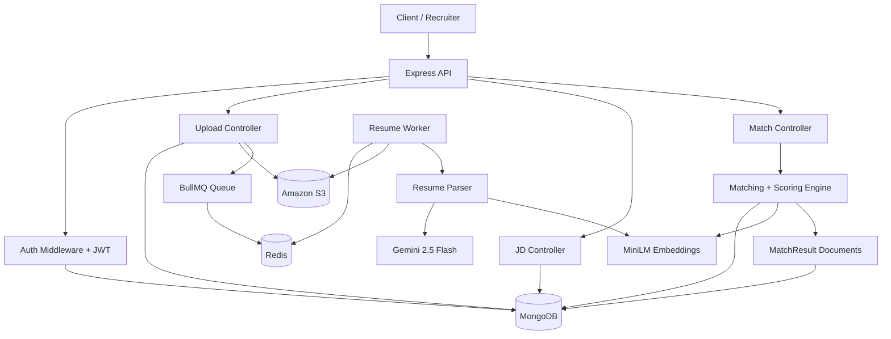
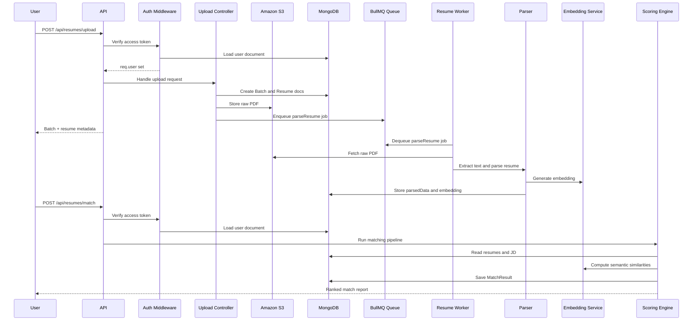
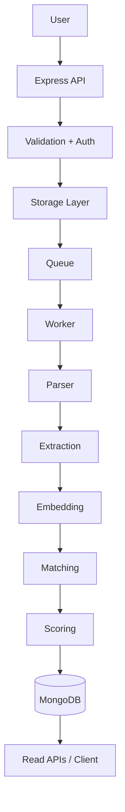
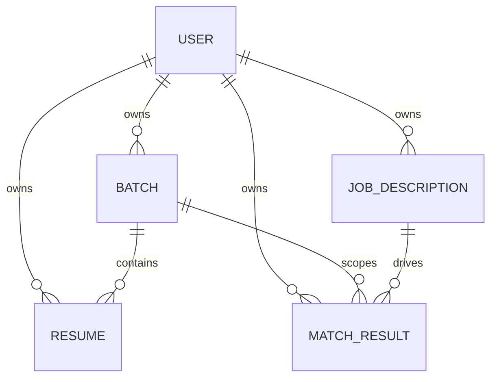

# HireMind Backend

HireMind is a Node.js backend for ingesting PDF resumes, extracting structured candidate data, creating job descriptions, and ranking candidates against those jobs with a multi-factor matching engine. It is built as a source-first production service: resumes are stored in S3, parsed asynchronously through BullMQ workers, normalized into MongoDB documents, and scored with a combination of embedding similarity, skill overlap, experience relevance, education, certifications, responsibilities, location fit, and domain alignment.

The system exists to solve a specific problem: teams often need to compare a large batch of resumes against one or more job descriptions without doing manual screening. HireMind automates the ingestion and ranking pipeline so a recruiter or hiring manager can upload files, wait for background parsing to complete, and then inspect ranked match reports with explanations.

The main users are backend developers, recruiters, and internal tooling teams who need a resumable pipeline for PDF intake, structured extraction, and candidate ranking. The design philosophy is practical rather than flashy: keep the API response structure consistent, keep ingestion asynchronous, make parsing resilient with fallbacks, and keep matching explainable enough that the output can be audited.

## Table Of Contents

- [Project Overview](#project-overview)
- [System Overview](#system-overview)
- [Architecture](#architecture)
- [High Level Architecture Diagram](#high-level-architecture-diagram)
- [Complete Request Flow Diagram](#complete-request-flow-diagram)
- [Project Folder Structure](#project-folder-structure)
- [Technology Stack](#technology-stack)
- [Architecture Layers](#project-architecture-layers)
- [Component Breakdown](#component-breakdown)
- [Matching Engine](#matching-engine)
- [Scoring Architecture](#scoring-architecture)
- [Data Flow](#data-flow)
- [Database Design](#database-design)
- [API Documentation](#api-documentation)
- [Queue System](#queue-system)
- [File Processing Pipeline](#file-processing-pipeline)
- [Machine Learning Pipeline](#machine-learning-pipeline)
- [Configuration](#configuration)
- [Installation](#installation)
- [Deployment](#deployment)
- [Security](#security)
- [Performance Optimizations](#performance-optimizations)
- [Error Handling](#error-handling)
- [Logging](#logging)
- [Scalability](#scalability)
- [Future Improvements](#future-improvements)
- [Developer Guide](#developer-guide)
- [Contributing Guidelines](#contributing-guidelines)
- [License](#license)
- [Appendix](#appendix)

## Project Overview

HireMind is a resume parsing and candidate-matching backend implemented as an ES module Node.js application. It exposes REST endpoints for authentication, resume upload and browsing, job description creation, and match generation. Uploaded PDF resumes are stored in Amazon S3, enqueued for background parsing, and then normalized into MongoDB documents. Matching runs against stored job descriptions or ad hoc JD payloads and returns ranked results with score breakdowns and explanations.

The project solves four connected problems:

- Ingest many PDF resumes without blocking the API.
- Extract structured resume content reliably even when the LLM path is unavailable.
- Normalize job descriptions so they can be scored consistently.
- Produce explainable rankings rather than opaque similarity scores.

Target users include recruiters, hiring teams, and engineers integrating a resume-screening workflow into internal systems. The codebase is also suitable as a reference architecture for combining object storage, task queues, semantic embeddings, and MongoDB-backed ranking pipelines.

## System Overview

### End-to-end workflow

1. A client authenticates through `/api/auth/login` or `/api/auth/signup`.
2. The client uploads one or more PDF resumes to `/api/resumes/upload`.
3. The upload controller creates a `Batch` record, creates `Resume` records, stores each raw file in S3, and enqueues a BullMQ parsing job for each valid file.
4. The worker process dequeues parsing jobs, downloads the PDF from S3, extracts text, runs the LLM parser when `GEMINI_API_KEY` is available, falls back to a regex parser otherwise, and stores `parsedData` plus an embedding on the resume document.
5. The client creates or submits a job description through `/api/resumes/jd` or supplies an ad hoc payload to `/api/resumes/match`.
6. The matching pipeline retrieves the JD and all relevant parsed resumes, scores each candidate, sorts by the final score, applies penalties, and persists a `MatchResult` document.
7. The client reads batches, resumes, or match reports from the read endpoints.

### Request lifecycle

The HTTP server is intentionally thin. Controllers validate input, coordinate services, and return JSON through the shared `ApiResponse` helper. Authentication middleware resolves a user from the access token and attaches the user document to `req.user`. Business logic is pushed into services so that the same matching routines can be reused by tests and scripts.

### Uploaded data lifecycle

Uploaded files start as temporary files on disk through `multer`. They are validated as PDFs, uploaded to S3 with a deterministic path shape, and then queued for asynchronous parsing. The worker converts them into structured resume data and a vector embedding. The batch status transitions from `processing` to `ready` when parsed plus failed resumes reaches the batch total.

### Background processing

Background parsing is handled by BullMQ with Redis as the queue backend. Each file becomes one `parseResume` job. The worker supports retry with exponential backoff, and failed jobs update the resume record and the batch counters.

### Scoring pipeline

Scoring is the combination of several independent scorers:

- embedding similarity
- skill overlap with exact and fuzzy matching
- domain similarity
- experience relevance
- education fit
- certification fit
- responsibility similarity
- location fit
- penalty aggregation

Each component produces a normalized score, which is then combined with weights and discounted by penalties to produce the final ranking score.

### Storage pipeline

MongoDB stores users, batches, resumes, job descriptions, and match results. S3 stores the raw resume PDFs. Redis stores the queue state, refresh tokens, and token blacklists when Redis is available.

### Inference pipeline

The inference path has two layers. First, parsing extracts structured resume data from text using Gemini 2.5 Flash when configured. Second, embeddings from `Xenova/all-MiniLM-L6-v2` are used for semantic comparison in skill matching, domain matching, responsibility matching, and final scoring.

## Architecture

### Major components

#### HTTP API layer

The Express application in [index.js](index.js) mounts two route groups: `/api/auth` and `/api/resumes`. It also exposes `/health` for runtime checks. This layer is responsible for request parsing, CORS, and connecting to MongoDB and Redis during startup.

#### Authentication and session layer

Authentication lives in [middlewares/auth.middlware.js](middlewares/auth.middlware.js), [controllers/auth.controller.js](controllers/auth.controller.js), and [configs/jwt.js](configs/jwt.js). It generates JWT access and refresh tokens, validates access tokens on protected routes, and uses Redis to store refresh tokens and blacklist logout tokens when Redis is available.

#### Ingestion layer

Resume upload is handled by [controllers/upload.controller.js](controllers/upload.controller.js) and [middlewares/upload.middleware.js](middlewares/upload.middleware.js). The upload flow creates batches and resumes, stores raw files to S3, and schedules parsing jobs.

#### Parsing layer

Parsing logic lives in [services/parse.service.js](services/parse.service.js) and [services/llm.service.js](services/llm.service.js). The parser extracts text from PDFs, tries an LLM-based JSON extraction path, and falls back to a regex parser.

#### Matching layer

Matching logic is split between [services/match/match.service.js](services/match/match.service.js), [services/match/scoring.service.js](services/match/scoring.service.js), and the service files under [services/match](services/match). This layer builds a full candidate profile score and stores match results.

#### Persistence layer

MongoDB models in [models](models) define the schema for users, resumes, batches, job descriptions, and match results. The models are simple and timestamped, with user scoping handled explicitly in query logic.

#### Queue and worker layer

BullMQ queue definitions are in [queues/resume.queues.js](queues/resume.queues.js). The worker in [workers/resume.workers.js](workers/resume.workers.js) fetches PDF bytes from S3, parses them, and updates MongoDB.

#### Utility layer

Utilities under [utils](utils) provide error wrappers, standardized response helpers, cosine similarity, constants, Mongo URI validation, and lightweight logging helpers.

## High Level Architecture Diagram



## Complete Request Flow Diagram



## Project Folder Structure

```text
.
├── API_DOC.md
├── README.md
├── design.md
├── evaluate_matching.js
├── index.js
├── worker.js
├── scan_resumes.js
├── scratch_view_joseph.js
├── package.json
├── configs/
├── controllers/
├── middlewares/
├── models/
├── queues/
├── routes/
├── services/
├── tests/
├── utils/
└── workers/
```

### Root files

- [index.js](index.js) starts the HTTP API server, connects to MongoDB and Redis, mounts route groups, and exposes the health endpoints.
- [worker.js](worker.js) starts the background parsing worker process.
- [evaluate_matching.js](evaluate_matching.js) is a standalone evaluation script that scores a small fixed set of sample job descriptions against a local resume cache or `data/` directory.
- [scan_resumes.js](scan_resumes.js) is a standalone sampling utility for inspecting resume text.
- [scratch_view_joseph.js](scratch_view_joseph.js) is a local exploration script for one PDF resume.
- [API_DOC.md](API_DOC.md) contains endpoint documentation, but it is not fully complete in the current repository.
- [design.md](design.md) is a design note describing a Bitcoin DeFi visual system; it is unrelated to the backend runtime.

### Configuration folder

- [configs/database.js](configs/database.js) connects to MongoDB and validates the URI.
- [configs/redis.js](configs/redis.js) creates the Redis client and exposes availability helpers.
- [configs/jwt.js](configs/jwt.js) generates, verifies, stores, and invalidates JWT-related tokens.
- [configs/s3.js](configs/s3.js) creates the AWS S3 client.
- [configs/encryption.js](configs/encryption.js) provides AES-256-GCM helpers for string encryption and decryption.

### Controllers folder

- [controllers/auth.controller.js](controllers/auth.controller.js) handles signup, login, refresh, and logout.
- [controllers/upload.controller.js](controllers/upload.controller.js) handles resume upload, batch creation, S3 storage, and queueing.
- [controllers/jd.controller.js](controllers/jd.controller.js) creates and stores job descriptions.
- [controllers/resume.controller.js](controllers/resume.controller.js) reads batches and resumes.
- [controllers/match.controller.js](controllers/match.controller.js) runs matching and returns match history.

### Middleware folder

- [middlewares/auth.middlware.js](middlewares/auth.middlware.js) validates bearer access tokens and loads the user document.
- [middlewares/upload.middleware.js](middlewares/upload.middleware.js) configures multer disk storage, file size limits, and file counts.

### Models folder

- [models/user.models.js](models/user.models.js) stores user accounts and hashed passwords.
- [models/batch.models.js](models/batch.models.js) stores batch metadata and counts.
- [models/resume.models.js](models/resume.models.js) stores uploaded resume metadata, raw S3 key, parsing status, parsed data, and embeddings.
- [models/jobDescription.models.js](models/jobDescription.models.js) stores raw and parsed job descriptions.
- [models/matchResult.models.js](models/matchResult.models.js) stores final ranking results and explanations.

### Queue and worker folders

- [queues/resume.queues.js](queues/resume.queues.js) defines the `resume-parsing` queue.
- [workers/resume.workers.js](workers/resume.workers.js) consumes queue jobs and updates resume and batch state.

### Services folder

- [services/parse.service.js](services/parse.service.js) extracts text from PDFs, parses resume structure, and generates embeddings.
- [services/jd.service.js](services/jd.service.js) parses job descriptions, extracts skills, experience, responsibilities, location, seniority, keywords, and embeddings.
- [services/embedding.service.js](services/embedding.service.js) produces embedding vectors from text.
- [services/llm.service.js](services/llm.service.js) calls Gemini for resume parsing.
- [services/match](services/match) contains the matching and scoring engine.

### Utilities folder

- [utils/ApiError.js](utils/ApiError.js) defines a small bad-request error type.
- [utils/ApiResponse.js](utils/ApiResponse.js) standardizes success and error response payloads.
- [utils/asyncHandler.js](utils/asyncHandler.js) wraps async route handlers.
- [utils/cosineSimilarity.js](utils/cosineSimilarity.js) computes vector similarity.
- [utils/constants.js](utils/constants.js) holds Mongo aggregation safety sets.
- [utils/validateMongoUri.js](utils/validateMongoUri.js) validates Mongo URI strings.
- [utils/logentries.js](utils/logentries.js) provides a simple file append logger helper.
- [utils/aiUtils.js](utils/aiUtils.js) exists in the tree, but the current runtime code does not depend on it.

## Technology Stack

| Area | Technology | Why it is used |
|---|---|---|
| Runtime | Node.js 18+ | ES module backend runtime for API, worker, and scripts |
| Web framework | Express 5 | REST routing, middleware, and JSON response handling |
| Database | MongoDB + Mongoose | Document storage for users, resumes, batches, JDs, and match results |
| Queue | Redis + BullMQ | Asynchronous parsing jobs and worker processing |
| File storage | Amazon S3 | Persistent raw resume storage before parsing |
| Authentication | JSON Web Tokens | Stateless access token and refresh token flow |
| Password hashing | bcrypt | Secure password hashing at user creation time |
| PDF extraction | pdf-parse | Extracts text from uploaded resume PDFs |
| NLP library | wink-nlp + wink-eng-lite-web-model | Lightweight entity and text processing for regex fallback parsing |
| Embeddings | @xenova/transformers | Local feature extraction using `Xenova/all-MiniLM-L6-v2` |
| LLM parsing | @google/generative-ai | Resume extraction fallback path when a Gemini key is present |
| Multipart uploads | multer | Handles temporary disk uploads |
| HTTP client / extras | axios, @openrouter/sdk, uuid, @aws-sdk/s3-request-presigner | Present in dependencies; not all are exercised by the current runtime paths |

## Project Architecture Layers

### Presentation

The presentation layer is the API boundary exposed by Express routes. It accepts JSON and multipart form data, authenticates requests, and returns consistent JSON payloads.

### Controllers

Controllers translate HTTP requests into service calls. They validate path and query parameters, build the input objects used by services, and return the final JSON response.

### Services

Services contain the business logic. Parsing, JD extraction, embedding generation, scoring, explanation generation, and penalty calculation all live here.

### Business logic

The business logic is mostly the matching pipeline. It determines how job descriptions are normalized, how skills are matched, how experience is weighted, and how penalties affect the final rank.

### Scoring engine

The scoring engine produces the final ranking score and explanation payload. It combines normalized component scores with the configured weights and applies penalties as a multiplicative discount.

### Matching engine

The matching engine coordinates JD parsing, resume scoring, sorting, limiting, and persistence of match reports.

### Storage

S3 stores raw PDFs. MongoDB stores the structured documents and results. Redis stores queue state and token state when available.

### Workers

The worker process consumes queue jobs and updates resume and batch state after parsing.

### Utilities

Utilities provide shared error handling, response formatting, and vector math.

### External APIs

Gemini is the only external inference API currently used in runtime code. The S3 SDK is used for object storage operations.

## Component Breakdown

### Authentication

Purpose: control access to protected routes.

Workflow: signup hashes the password through a Mongoose pre-save hook, login verifies credentials and issues tokens, refresh validates the refresh token, logout blacklists the access token and removes the refresh token when Redis is active.

Dependencies: user model, JWT config, Redis availability.

Output: access tokens, refresh tokens, authenticated user document.

### Resume Upload

Purpose: accept PDF resumes and start asynchronous parsing.

Workflow: validate upload presence, create a batch, create resume documents, store file to S3, enqueue parse jobs, update batch counters for failures, and return batch plus accepted and rejected files.

Dependencies: multer, S3, queue, batch and resume models.

Output: batch metadata, resume metadata, failure details.

### Job Description Creation

Purpose: normalize raw JD text into a structured document.

Workflow: parse title, rawText, keywords, skills, minimum experience, seniority, location, responsibilities, and embedding. Store the result in MongoDB.

Dependencies: JD parser, embedding service, job description model.

Output: a persisted `JobDescription` document.

### Resume Parser

Purpose: convert PDF bytes into structured candidate data.

Workflow: extract text from the PDF, try Gemini JSON extraction, normalize the returned object, otherwise use the regex pipeline, and generate a resume embedding.

Dependencies: pdf-parse, Gemini SDK, wink NLP, regex parsers, embedding service.

Output: structured `parsedData` plus a numeric embedding vector.

### Job Parser

Purpose: convert raw JD text into a consistent internal shape for matching.

Workflow: extract skills from title and text, infer seniority, minimum experience, location, responsibilities, merge explicit skill input, and generate the JD embedding.

Dependencies: `extractSkills`, text parsing helpers, embedding service.

Output: structured JD object with normalized fields.

### Embedding Generator

Purpose: produce semantic vectors for resumes, JDs, skills, and responsibilities.

Workflow: lazily load the `feature-extraction` pipeline once and reuse it across calls.

Dependencies: `@xenova/transformers`.

Output: embedding arrays of numbers.

### Matching Engine

Purpose: rank candidates against a JD.

Workflow: load JD, load parsed resumes, score each resume, sort, persist results, and return the stored report.

Dependencies: scoring service, JobDescription model, Resume model, MatchResult model.

Output: a `MatchResult` document with ranked candidates.

### Domain Classifier

Purpose: estimate whether a resume belongs to the same technical domain as the JD.

Workflow: strip generic terms, build domain profile text, embed the profiles, compare via cosine similarity.

Dependencies: embedding generator, cosine similarity utility.

Output: domain score, mismatch flag, extracted JD and resume profile strings.

### Skill Matcher

Purpose: compare JD skills to resume skills.

Workflow: exact lowercased matching first, then semantic fuzzy matching above the configured threshold, then mandatory/preferred classification from the JD text.

Dependencies: embedding generator, cosine similarity utility, extracted JD skills.

Output: matched skills, missing skills, mandatory/preferred splits, fuzzy match count.

### Experience Analyzer

Purpose: quantify overall experience and domain-relevant experience.

Workflow: parse duration strings, infer candidate seniority from titles, compare with JD minimum experience, score relevance and level fit.

Dependencies: domain concept extraction.

Output: total years, relevant years, seniority, years score, relevance score, seniority score.

### Education Matcher

Purpose: infer whether the candidate meets degree expectations.

Workflow: detect JD degree requirements from text, map candidate degrees to levels, compare field relevance.

Dependencies: resume education data and JD text.

Output: degree score, field score, highest degree, required degree.

### Certification Matcher

Purpose: detect common certification requirements.

Workflow: scan the JD for known certification aliases and compare against resume certifications.

Dependencies: simple alias database embedded in the service.

Output: matched certificates, missing certificates, score.

### Responsibility Matcher

Purpose: compare JD responsibilities to resume experience descriptions semantically.

Workflow: embed each responsibility and each experience snippet, compare pairwise, take the best similarity per responsibility, normalize to a score.

Dependencies: embedding generator, cosine similarity utility.

Output: normalized responsibility score and raw similarity data.

### Location Matcher

Purpose: score geographic compatibility.

Workflow: handle remote JDs, hybrid cases, and token-based city matching.

Dependencies: JD location field and resume contact location.

Output: location score and explanation.

### Penalty Engine

Purpose: discount strong-looking candidates when critical requirements are missing.

Workflow: apply penalties for severe domain mismatch, missing mandatory skills, missing preferred skills, insufficient relevant experience, missing degree requirements, and missing required certifications.

Dependencies: component score objects and JD requirements.

Output: cumulative penalty and a list of reasons.

### Explanation Generator

Purpose: explain why a candidate scored as they did.

Workflow: turn component scores into strengths, weaknesses, and a numeric breakdown.

Dependencies: score objects and penalty reasons.

Output: human-readable explanation payload.

## Matching Engine

The matching engine is the core of the system. It transforms structured resume data and structured JD data into an ordered candidate list.

### Overall pipeline

1. Load the JD, either by database ID or by parsing an ad hoc payload.
2. Merge weights from the caller and the stored JD weights.
3. Fetch parsed resumes for the user, optionally filtered by batch.
4. Score each resume independently.
5. Sort results by final score, then embedding score, then experience score.
6. Truncate to the requested limit if one is provided.
7. Persist the complete match result.

### Parsing and normalization

The JD parser normalizes title, raw text, keywords, required skills, minimum experience, seniority, location, responsibilities, and explicit skills. The resume parser normalizes contact details, experience, education, skills, certifications, projects, and optional structured fields.

### Preprocessing

The preprocessing step is important because the matching logic expects canonical field names and arrays. For example, skills must be arrays of `{ name, category }` objects, not arbitrary strings. Experience entries must include dates or descriptions that can be parsed into duration and relevance signals.

### Domain classification

Domain classification is intentionally generic. It does not hardcode industry taxonomies. Instead, it removes common role filler words and compares the semantic content of the JD and resume through embeddings.

### Embeddings and semantic similarity

The embedding service uses `Xenova/all-MiniLM-L6-v2` with mean pooling and normalization. Cosine similarity is then used as the vector metric. Semantic similarity is used in three places:

- fuzzy skill matching
- domain matching
- responsibility matching

### Required skills and preferred skills

The skill service classifies each required skill as mandatory or preferred by inspecting the JD text for language such as `preferred`, `optional`, `nice to have`, or `desired`. Mandatory misses are penalized more heavily than preferred misses.

### Penalties

Penalties are additive and then converted into a multiplicative discount. The engine intentionally keeps a floor so a strong candidate is not reduced to zero by a few missing signals.

### Weighting and aggregation

Weights are applied to the normalized component scores. The final score is not just a weighted sum; it is the weighted sum multiplied by a discount derived from penalties.

### Ranking

The engine sorts candidates by final score, then by embedding score, then by experience score. This tie-breaking makes semantic fit and experience matter after the primary score.

### Why each step exists

Each step isolates a different hiring signal. Skill matching identifies must-have fit, experience captures career depth, education and certifications handle role constraints, domain matching prevents cross-domain false positives, and responsibilities check whether the candidate has worked on the kinds of tasks the role actually requires.

## Scoring Architecture

### Default weights in code

| Component | Default weight |
|---|---:|
| embedding | 0.25 |
| skills | 0.30 |
| experience | 0.20 |
| responsibility | 0.10 |
| education | 0.05 |
| certification | 0.05 |
| location | 0.05 |

The JD parser may persist custom weights, and the match endpoint may also receive ad hoc weights. The current merge strategy in [services/match/match.service.js](services/match/match.service.js) starts from caller weights and then overlays stored JD weights.

### Skill score

Formula: `matched required skills / total unique required skills`

The score uses exact matches first and fuzzy matches second. Fuzzy matches are accepted when semantic similarity is at least `0.82`.

### Experience score

Formula used in code:

$$
score = 0.4 \cdot yearsScore + 0.4 \cdot relevanceScore + 0.2 \cdot seniorityScore
$$

Years score compares domain-relevant years to the JD minimum experience. Relevance score compares domain-relevant years to total years. Seniority score compares inferred candidate seniority to JD seniority.

### Education score

The education score combines degree level and field relevance:

$$
score = 0.7 \cdot degreeScore + 0.3 \cdot fieldScore
$$

### Certification score

The certification score is the fraction of required certifications matched from a fixed alias database.

### Responsibility score

Each responsibility is embedded and matched against the candidate experience texts. The best similarity per responsibility is averaged, then normalized into a 0 to 1 score.

### Location score

Location score is rule-based. Remote roles score highest for compatibility, hybrid and onsite roles rely on token overlap, and unknown locations land at a neutral partial score.

### Domain score

Domain score is the cosine similarity of embedded domain concept text. A `primaryMismatch` flag is set when the score falls below `0.22`.

### Penalty system

Penalty rules in code include:

- `0.35` for severe domain mismatch
- up to `0.40` for missing mandatory skills
- up to `0.08` for missing preferred skills
- up to `0.30` for missing relevant years of experience
- `0.15` for insufficient degree level
- `0.10` for missing all required certifications

The final score uses a discount floor of `0.10`, so the weighted score is reduced but not annihilated.

### Final weighted score

The final score is:

$$
finalScore = clamp\big(weightedScore \cdot max(0.10, 1 - totalPenalty), 0, 1\big)
$$

## Data Flow



The practical movement of data is:

1. User credentials or upload request enter through the API.
2. Authentication verifies the user.
3. Uploads land in temporary disk storage and then S3.
4. Queue jobs trigger background parsing.
5. Parsed resume JSON and embeddings are written back to MongoDB.
6. Matching queries pull parsed resumes and JDs from MongoDB.
7. Score results are persisted as match reports and read back through the API.

## Database Design

### User

Purpose: authentication and ownership.

Fields:

- `name`: required string
- `email`: required unique string, lowercased
- `password`: required hashed string
- timestamps

Relationships: user owns batches, resumes, job descriptions, and match results through `userId` on those records.

Indexes: email is unique; `userId` is used for lookups.

### Batch

Purpose: track a grouped upload session.

Fields:

- `userId`: required string
- `name`: batch label
- `totalResumes`: number
- `parsedResumes`: number
- `failedResumes`: number
- `status`: `processing` or `ready`
- timestamps

Lifecycle: created at upload time, incremented as resume jobs finish, marked ready once totals are complete.

### Resume

Purpose: store raw upload metadata and parsed resume output.

Fields:

- `userId`: required string
- `batchId`: required `ObjectId` reference to `Batch`
- `originalFileName`: original upload filename
- `s3RawKey`: S3 object key for the raw PDF
- `status`: `pending`, `parsed`, or `failed`
- `parsedData`: mixed structured payload
- `embedding`: numeric vector array
- timestamps

Relationships: belongs to one batch and one user.

Indexes: `userId` and `batchId` are indexed.

### JobDescription

Purpose: normalize and persist role requirements.

Fields:

- `userId`: required string
- `title`: optional title
- `rawText`: required raw JD text
- `keywords`: string array
- `requiredSkills`: mixed array
- `minimumExperience`: mixed object
- `seniority`: string
- `location`: string
- `responsibilities`: string array
- `skills`: mixed array
- `embedding`: numeric vector array
- `weights`: mixed object or null
- timestamps

### MatchResult

Purpose: store ranked outputs for a JD and an optional batch.

Fields:

- `userId`: required string
- `jobDescriptionId`: optional `ObjectId` reference to `JobDescription`
- `batchId`: optional `ObjectId` reference to `Batch`
- `weights`: mixed object
- `results`: array of per-resume scores
- timestamps

Per-result fields:

- `resumeId`
- `candidateName`
- `finalScore`
- `scores` object
- `domain` object
- `explanation` object

### ER view



## API Documentation

All successful API responses currently use the `ApiResponse.success` format:

```json
{
  "statusCode": 200,
  "message": "...",
  "data": { ... }
}
```

Known error responses are not fully normalized yet. Some errors return `message`, `cause`, and `error` fields through `utils/asyncHandler.js`, while `ApiResponse.unauthorized` returns a 401 wrapper with an empty string payload. New code should be aware of that inconsistency.

### Authentication

#### POST /api/auth/signup

Creates a user account.

Request body:

- `name` optional
- `email` required
- `password` required

#### POST /api/auth/login

Authenticates a user and returns access and refresh tokens.

#### POST /api/auth/refresh

Refreshes the access token using a refresh token in the body or `Authorization` header.

#### POST /api/auth/logout

Requires bearer access token, blacklists the token when Redis is available, and deletes the stored refresh token.

### Resume and batch ingestion

#### POST /api/resumes/upload

Protected. Accepts multipart form data with a `resumes` file array and optional `batchName`.

Behavior:

- only PDF files are accepted
- each accepted file is uploaded to S3
- each accepted file creates a queue job
- each invalid file is marked failed immediately

#### GET /api/resumes/batches

Returns batches for the authenticated user.

Query params: `page`, `limit`, `status`.

#### GET /api/resumes/batches/:batchId

Returns one batch plus computed progress.

#### GET /api/resumes/batches/:batchId/progress

Returns batch progress only.

#### GET /api/resumes/batches/:batchId/resumes

Returns all resumes in a batch. Optional `status` filter.

#### GET /api/resumes/resumes

Returns paginated resumes for the user. Optional `status` and `batchId` filters.

#### GET /api/resumes/resumes/:resumeId

Returns one resume document.

### Job descriptions

#### POST /api/resumes/jd

Creates and stores a normalized job description from raw text.

### Matching and ranking

#### POST /api/resumes/match

Runs the matching pipeline.

Accepted inputs:

- `jobDescriptionId` plus optional `batchId` and `limit`
- or `jdPayload` plus optional `batchId`, `weights`, and `limit`

#### GET /api/resumes/matches

Returns the user’s match history with pagination.

#### GET /api/resumes/matches/:matchId

Returns one match report.

### Endpoint summary

| Method | Route | Purpose |
|---|---|---|
| POST | /api/auth/signup | Register a user |
| POST | /api/auth/login | Authenticate and issue tokens |
| POST | /api/auth/refresh | Refresh access token |
| POST | /api/auth/logout | Logout and revoke session state |
| POST | /api/resumes/upload | Upload PDF resumes |
| GET | /api/resumes/batches | List batches |
| GET | /api/resumes/batches/:batchId | Get batch details |
| GET | /api/resumes/batches/:batchId/progress | Get batch progress |
| GET | /api/resumes/batches/:batchId/resumes | List resumes in batch |
| GET | /api/resumes/resumes | List resumes |
| GET | /api/resumes/resumes/:resumeId | Get resume details |
| POST | /api/resumes/jd | Create job description |
| POST | /api/resumes/match | Run matching pipeline |
| GET | /api/resumes/matches | List match reports |
| GET | /api/resumes/matches/:matchId | Get match report |

## Queue System

HireMind uses BullMQ with a single queue named `resume-parsing`.

### Queue behavior

- Queue definition: [queues/resume.queues.js](queues/resume.queues.js)
- Worker consumer: [workers/resume.workers.js](workers/resume.workers.js)
- Retry policy: 3 attempts with exponential backoff starting at 5 seconds
- Removal policy: successful jobs are removed on completion, failed jobs are retained

### Job lifecycle

1. `upload.controller.js` creates a queue job after S3 upload.
2. BullMQ stores the job in Redis.
3. The worker receives the job and loads the resume from MongoDB.
4. The worker downloads the PDF from S3.
5. The parser extracts structured data and embeddings.
6. The resume is updated to `parsed` or `failed`.
7. Batch counters are incremented.

### Failure handling

If a job fails, the worker updates the resume status to `failed`, increments the batch failure count, and attempts to update the batch readiness state. The upload controller also records immediate validation failures such as unsupported file types.

## File Processing Pipeline

1. The client sends multipart form data containing PDFs.
2. Multer writes files to the operating system temp directory.
3. The controller validates MIME type and extension.
4. The controller creates a resume document with `pending` status.
5. The raw PDF is stored in S3 under a key shaped like `userId/batchId/raw/resumeId.pdf`.
6. The file is queued for parsing.
7. The worker downloads the raw file and extracts text.
8. The parser attempts LLM extraction.
9. The parser falls back to regex extraction if the LLM path is unavailable.
10. The parser generates a resume embedding.
11. MongoDB is updated with the structured result.

## Machine Learning Pipeline

### Feature extraction

The resume and JD pipelines both produce embedding vectors with the same local transformer model. The model is loaded lazily and reused.

### Semantic comparison

Cosine similarity is used throughout the matching layer to compare embeddings.

### Skill matching

Skills are first matched exactly, then semantically. This reduces false negatives for common aliases like `Node.js` versus `nodejs`, `Kubernetes` versus `k8s`, or `AWS` versus `Amazon Web Services`.

### Domain matching

Domain matching reduces the chance that a strong but unrelated resume outranks a weaker but domain-relevant one.

### Ranking output

The final rank is explainable. Each candidate includes both a numeric result and a structured explanation payload.

## Configuration

The repository includes [/.env.example](.env.example). The implementation uses the following variables:

| Variable | Required | Used by | Notes |
|---|---|---|---|
| `MONGO_URI` | Yes | database connection | `MONGODB_URI` is also accepted by the database connector, but the example file uses `MONGO_URI` |
| `REDIS_URL` | Yes for queue/token state | Redis client | Required for BullMQ and optional token storage features |
| `ACCESS_TOKEN_SECRET` | Yes | JWT signing | Used to sign access tokens |
| `REFRESH_TOKEN_SECRET` | Yes | JWT signing | Used to sign refresh tokens |
| `AWS_REGION` | Yes | S3 client | Region for the raw resume bucket |
| `AWS_BUCKET_NAME` | Yes | S3 upload/download | Bucket that stores PDFs |
| `AWS_ACCESS_KEY` | Yes | S3 client | Access key name used in code |
| `AWS_SECRET_KEY` | Yes | S3 client | Secret key name used in code |
| `DB_ENCRYPTION_KEY` | Optional but validated if `configs/encryption.js` is imported | AES helper | Must decode to 32 bytes for AES-256-GCM |
| `GEMINI_API_KEY` | Optional | LLM resume parsing | Enables JSON parsing through Gemini; fallback regex parser still works |
| `PORT` | Present in example, but not currently read by `index.js` | server docs only | The current HTTP server listens on hardcoded port `3000` |

Important note: the current code reads `MONGO_URI` or `MONGODB_URI` for MongoDB, reads `REDIS_URL` for Redis, and reads `AWS_ACCESS_KEY` / `AWS_SECRET_KEY` for S3. The older `AWS_ACCESS_KEY_ID` and `AWS_SECRET_ACCESS_KEY` names are not what the current S3 config uses.

## Installation

### Prerequisites

- Node.js 18 or newer
- MongoDB instance
- Redis instance
- AWS S3 bucket for raw resume storage
- Optional Gemini API key for LLM-based parsing

### Setup

1. Install dependencies.

```bash
npm install
```

2. Create a `.env` file from [/.env.example](.env.example) and populate real values.

3. Start the API and worker together.

```bash
npm run dev
```

4. Or run them separately.

```bash
npm run start-server
npm run start-worker
```

### Tests and scripts

```bash
npm test
node evaluate_matching.js
node scan_resumes.js
```

The repository currently has a single Node test file at [tests/match.test.js](tests/match.test.js). It exercises scoring, parsing, and a Mongo integration path when a database URI is available.

## Deployment

No Dockerfile, docker-compose file, or CI/CD workflow is present in the repository. The current deployment story is therefore source-based and environment-driven.

### Current runtime shape

- one long-running HTTP process from [index.js](index.js)
- one long-running worker process from [worker.js](worker.js)
- one MongoDB instance
- one Redis instance
- one S3 bucket

### Production concerns

- Run the API and the worker as separate processes.
- Ensure Redis is available before starting the worker.
- Ensure MongoDB and S3 credentials are configured in the environment.
- Use a process manager or orchestration platform outside the repository if you need restarts, health checks, or scaling.

### Current limitations

- The server listens on a hardcoded port `3000`.
- No container build artifacts are present.
- No Kubernetes, Helm, Terraform, or Bicep files are present.
- No CI pipeline configuration is present.

## Security

### Authentication and authorization

Protected routes use bearer access tokens. Middleware looks up the user in MongoDB and attaches the sanitized user document to `req.user`.

### Password storage

Passwords are hashed with bcrypt in a Mongoose pre-save hook.

### Token handling

Refresh tokens are stored in Redis when Redis is available. Logout blacklists the access token and deletes the refresh token entry.

### Input validation

The code validates ObjectId values for JD, batch, resume, and match IDs. Upload validation rejects non-PDF files.

### Storage security

Raw resumes are stored in S3 rather than in the database. Temporary upload files are deleted after processing.

### Secret handling

Secrets are read from environment variables. The repository does not commit secret values.

## Performance Optimizations

- Embedding pipeline is loaded lazily and reused.
- The responsibility service caches JD embeddings by JD ID or responsibility string.
- The queue decouples upload latency from parsing latency.
- Batch and resume queries use indexed `userId` fields.
- Fuzzy matching only runs for skills that did not match exactly.
- Candidate scoring is parallelized with `Promise.all` at the per-resume level.

## Error Handling

The codebase uses two layers of error handling:

1. `ApiError.badRequest(...)` for known business validation failures.
2. `asyncHandler` for route wrappers that convert thrown errors into JSON responses.

Known behavior:

- validation errors generally return status 400
- unauthorized token states can return 401 through `ApiResponse.unauthorized`
- unexpected errors are currently returned through the async wrapper with a `510` response shape

The worker has its own failure logging and retry logic. Queue failures update MongoDB state so the batch does not remain permanently incomplete when a parse fails.

## Logging

Logging is intentionally lightweight.

- The API server logs successful Mongo and Redis connections.
- The worker logs job completion and failure states.
- `llm.service.js` logs Gemini parsing failures as warnings and falls back safely.
- `utils/logentries.js` provides a file append helper, although the current runtime does not rely on a centralized log pipeline.

## Scalability

### Horizontal scaling

The API can be scaled independently from the worker because parsing is queue-based. The worker can also be scaled horizontally if the queue and storage layer can absorb the load.

### Queue scaling

BullMQ with Redis allows multiple workers to process parsing jobs concurrently. The current worker config uses concurrency `3`.

### Database scaling

MongoDB is used for document storage and query filtering by user, batch, and status. Indexes on `userId` and `batchId` are the primary query accelerators in the current code.

### Storage scaling

S3 offloads large raw files from application memory and the database.

### Practical constraints

The embedding model and Gemini calls are the most expensive parts of the pipeline. For large-scale deployments, those should be monitored carefully.


### Glossary

| Term | Meaning |
|---|---|
| Batch | A group of uploaded resumes processed together |
| JD | Job Description |
| Resume embedding | Vector representation of a parsed resume |
| Domain score | Semantic fit between the JD domain and the resume domain |
| Mandatory skill | Required skill inferred from JD text as non-optional |
| Preferred skill | Skill inferred as nice-to-have or optional |

### Common workflows

#### Upload and parse resumes

1. Sign in.
2. Upload PDF resumes.
3. Wait for batch readiness.
4. Inspect parsed resume records.

#### Create a match report

1. Create a JD.
2. Upload or select a batch.
3. Run `/api/resumes/match`.
4. Review ranked candidates and explanations.

#### Inspect worker behavior

1. Start the worker with `npm run start-worker`.
2. Watch the queue logs and MongoDB updates.
3. Confirm batch progress reaches `ready`.

